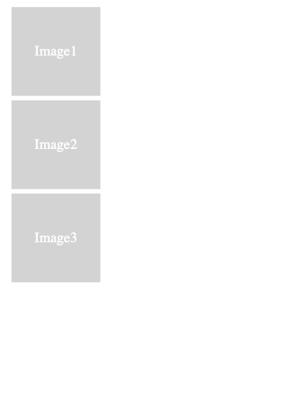
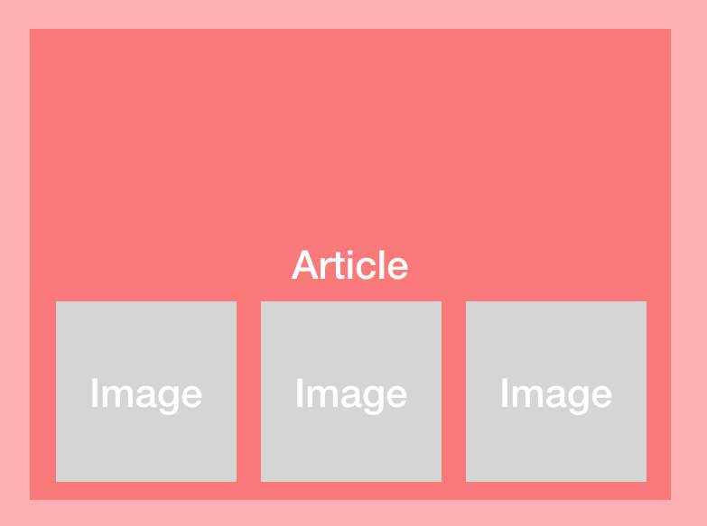
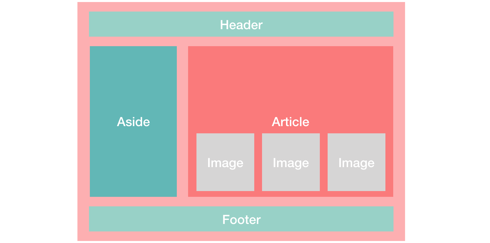

Este es un `laboratorio práctico` del modulo de CSS del curso `JavaScript Front End` de ADA SCHOOL.

## Lo que debes lograr

Observa estos tres cuadrados que ya estan hechos en el archivo index.html, y que representan contenedores con imágenes. 

Cómo los manejarías, utilizando CSS y HTML, para que tengan una distribución organizada?

### Estado Inicial




### Tarea 1
Intenta primero lograr la siguiente distribucion de los cuadrados. Cuando lo hayas logrado 🎉, continúa con la tarea 2.



### Tarea 2
Aplica todos tus conocimientos para llegar a esta disposicion de los elementos. No olvides usar ´Flexbox´ y ´Grid´.



## Recomendaciones
Toma en cuenta estas sugerencias para lograr un buen resultado:

- Siéntete libre de modificar `index.html` y `styles.css` de la manera que quieras, aumentando o quitando palabras, clases, etiquetas o lo que haga falta 🛠.

- Asigna fondos de colores 🌈 a los elementos que vas creando para que te ayuden a visualizar los cambios que realizas 🧐.

- No existe una única solución correcta, ya que hay muchas formas de lograrlo, encuentra tu propia manera de hacerlo 💪🏼!

- No olvides usar "Grid" y "Flexbox" donde sea necesario🤓.

## Instrucciones

1. Clona este repositorio en tu carpeta de trabajo local.

2. Desvincúlalo del repositorio origen ejecutando el comando de git:

```bash
git remove rm origin
```
3. Con el boton derecho sobre el archivo index.html, elije la opción `open with Live Server` para que index.html se abra en tu navegador y puedas ver los cambios que realizas con CSS. 


Si no tienes esta opción habilitada debes instalar la extensión `Live Server` de VSC (Visual Studio Code).


Si tienes alguna dificultad para configurar adecuadamente tu VSC puedes volver a revisar la sesión en vivo del módulo de VSC o solicitar asistencia en el canal de Slack.

También puedes utilizar Replit si te es mas cómodo y fácil de usar, lo importante es que pongas en `práctica` lo aprendido🤓.

3. Comienza a trabajar 👩🏻‍💻 modificando y creando estilos para logral tu objetivo. Si tienes dudas, vuelve a revisar los videos del módulo, ya que ahi esta toda la información que necesitas para completar este laboratorio.

4. Avanzado: cuando estes listo con los resultados, puedes subir tu trabajo a tu repositorio personal de GitHub y compartir el link en el canal de Slack para que todos podamos verlo 🚀.

